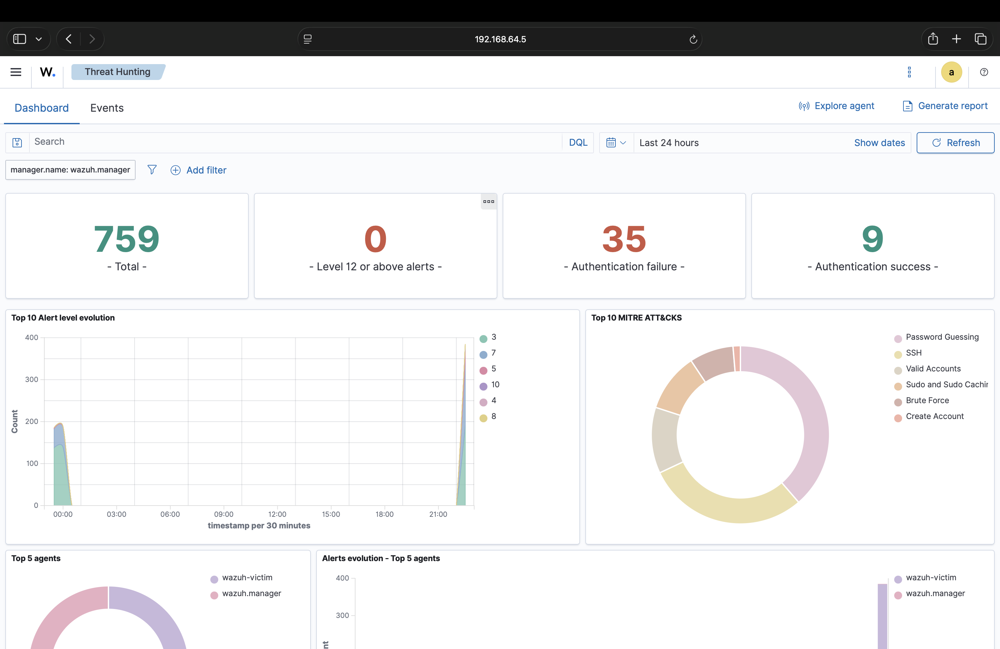
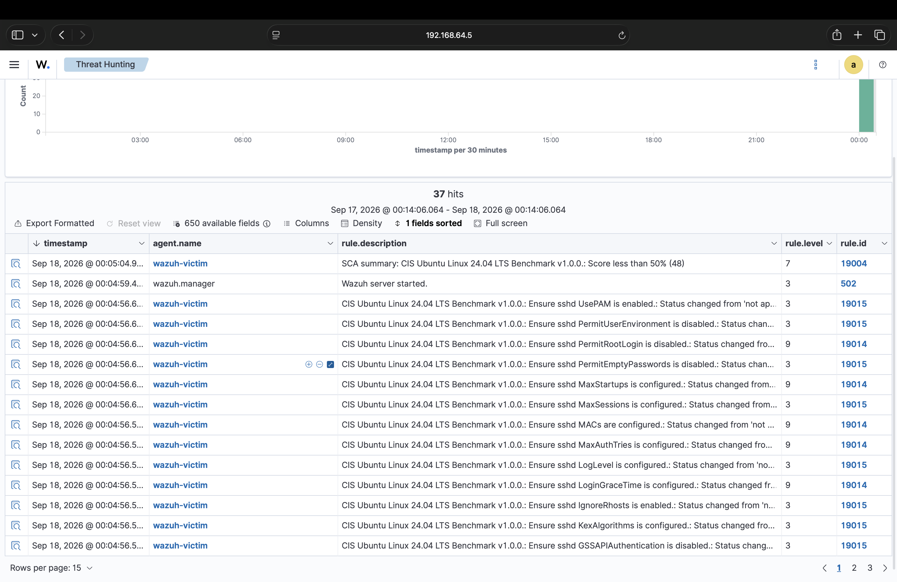
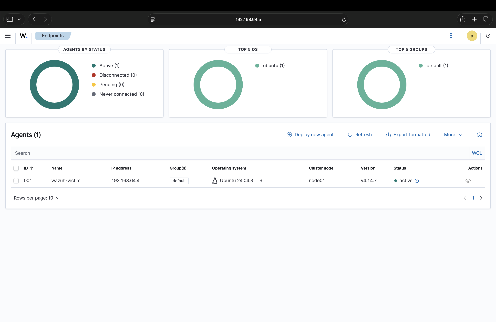

# SOC Home Lab & SIEM Configuration

## Overview
A personal home lab simulating a real Security Operations Centre (SOC) environment. Wazuh open-source SIEM is deployed via Docker across two virtualised machines to replicate enterprise security monitoring. Real-world 
attacks are simulated against a victim VM, detected by Wazuh, and documented as structured incident reports.

## Lab Architecture
- **Host:** MacBook M3, 8GB RAM, UTM hypervisor
- **Manager VM:** Ubuntu Server 24.04 ARM64, 4GB RAM, Running Wazuh SIEM (server + indexer + dashboard) via Docker
- **Victim VM:** Ubuntu Desktop 24.04 ARM64, 2GB RAM, Monitored endpoint with Wazuh agent installed

## Attacks Simulated
1.  Attack: SSH Brute Force Tool 
    Tool: Hydra
    Alerts Generated: 46+ auth failures, 770+ total alerts 
    MITRE Technique: T1110 Brute Force 

## Incident Reports
- [Incident 1 — SSH Brute Force Attack](docs/incidentreport-1.md)
- [Incident 1 — Nmap Reconnaissance Scan](docs/incidentreport-2.md)

## Setup Troubleshooting Log
Full documentation of the setup process including 7 issues encountered 
and resolved — see [labnotes.md](docs/labnotes.md)

## Screenshots
### Threat Hunting Dashboard — Brute Force Attack Detected

### Wazuh SCA Assessment — Following Nmap Reconnaissance Scan

### Active Agent — Victim VM Connected

## Technologies Used
- Wazuh SIEM v4.14.7
- Docker & Docker Compose
- Ubuntu Server/Desktop ARM64
- UTM Hypervisor (Apple M3)
- Hydra
- Linux, Bash, SSH

## Next Steps
- [x] Deploy Wazuh SIEM via Docker
- [x] Connect victim VM as monitored agent
- [x] Simulate SSH brute force attack
- [x] Document first incident report
- [x] Simulate Nmap reconnaissance scan
- [ ] Write custom Wazuh detection rule
- [ ] Simulate Metasploit exploitation
- [ ] Document further incident reports

## References
- [Wazuh Documentation](https://documentation.wazuh.com)
- [MITRE ATT&CK Framework](https://attack.mitre.org)
- [Docker Documentation](https://docs.docker.com)
- [CIS Benchmarks](https://www.cisecurity.org/cis-benchmarks)
- [TryHackMe Pre-Security Path](https://tryhackme.com)
